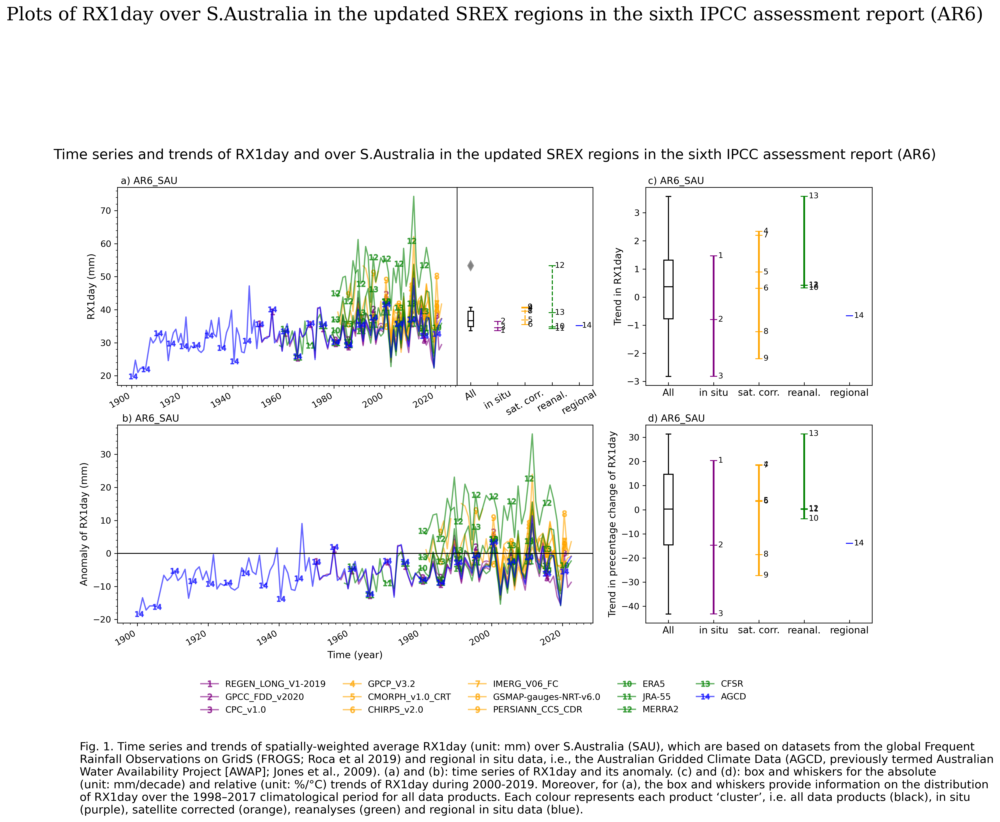

# Intercomparison-of-precipitation-extremes-from-FROGS-and-regional-datasets
This repository contains Python functions for generating spatial and time series plots for the *"Intercomparison of Precipitation Extremes from the Global Frequent Rainfall Observations on GridS (FROGS; Roca et al., 2019) and Regional Datasets"*, following the work by Alexander et al. (2020).


# Plotting Functions

`plot_time_series_and_trend_boxplots`
`plot_spatial_patterns`
`plot_spatial_patterns_diff`



Sample plot by the function "plot_time_series_and_trend_boxplots"

## Usage

### Installation

1. Clone the repository:

    ```bash
    git clone https://github.com/your-username/your-repository.git
    ```

2. Install dependencies:

    ```bash
    pandas
    seaborn
    numpy
    xarray
    math
    matplotlib
    cartopy
    ```

## Example: How to Use the `plot_spatial_patterns` Function

To use the `plot_spatial_patterns` function, follow these steps:

1. Place the file in the directory where you want to use the function.

2. In your Python script or Jupyter Notebook, import the function:

```python
import sys
sys.path.append('/path/to/directory/containing/plotting_functions.py')

from plotting_functions import plot_spatial_patterns
```

3. Running the Function

To use the `plot_spatial_patterns` function, you need to provide the necessary input parameters. Modify the function call in your script accordingly.

```python
# Import the function
from your_module import plot_spatial_patterns

# Example input parameters
spatial_patterns = ...  # Your spatial patterns data as an xarray.DataArray object
datasets_names = ["REGEN_LONG_V1-2019", "GPCC_FDD_v2020", "CPC_v1.0"...]  # List of dataset names
boundary_kwargs = {'lon_reg_min': 109.5, 'lon_reg_max': 155.5, 'lat_reg_min': -45.5, 'lat_reg_max': -9.5}  # Boundary settings
cluster_kwargs = {'num_insitu': 3, 'num_sat': 6, 'num_reanal': 4, 'num_reg': 1}  # Cluster settings
txt_kwargs = {
    'ylabel_ts': 'R10mm (days)',
    'ylabel_ts_ano': 'Anomaly of R10mm (days)',
    'cbar_lb_sp': 'R10mm (days)',
    'cbar_lb_sp_diff': 'Difference in R10mm (days)',
    'ylabel_box_abs': 'Trend in R10mm',
    'ylabel_box_rel': 'Trend in percentage change of R10mm',
    'pr_indx_n': 'R10mm',
    'pr_indx_n_unit': '(days)',
    'pr_indx_n_trabs_unit': '(days/decade)',
    'pr_indx_n_trrel_unit': '(%/\N{DEGREE SIGN}C)',
    'region_n': 'C. Australia',
    'base_p_n': '1998–2017',
    'trend_p_n': '2000-2019',
    'reg_data_details': 'Regional in situ data from Australian Gridded Climate Data (AGCD).'
}
```

4. Call the function

```python
plot_spatial_patterns(spatial_patterns, datasets_names, boundary_kwargs, cluster_kwargs, txt_kwargs)
```

## References
Alexander, L. V., Bador, M., Roca, R., Contractor, S., Donat, M. G., & Nguyen, P. L. (2020). Intercomparison of annual precipitation indices and extremes over global land areas from in situ, space-based and reanalysis products. *Environmental Research Letters, 15*(5), 055002.

Roca, R., Alexander, L. V., Potter, G., Bador, M., Jucá, R., Contractor, S., ... & Cloché, S. (2019). FROGS: a daily 1× 1 gridded precipitation database of rain gauge, satellite and reanalysis products. *Earth System Science Data, 11*(3), 1017-1035.

